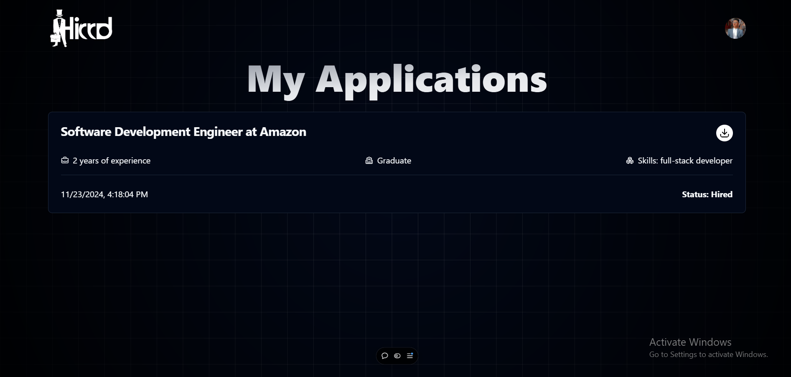

# **Hirrd**

A simple and real-time job portal platform designed to bridge the gap between candidates and recruiters. **Hirrd** empowers candidates to explore job opportunities, save their favorite listings, and track application statuses, while enabling recruiters to post jobs with rich descriptions and manage applicants seamlessly.

---

## **Features**

### **Candidate Features**

- **Job Search**: Search jobs by location, company, or title.
- **Job Bookmarking**: Save and unsave jobs for later review.
- **Job Applications**: Apply for jobs and track real-time application statuses updated by recruiters.
- **Onboarding**: Guided onboarding process for candidates to get started quickly.

### **Recruiter Features**

- **Job Postings**: Create job listings with a **rich text editor** for detailed descriptions.
- **Application Management**: Update and manage application statuses in real-time.
- **Onboarding**: Easy onboarding to set up recruiter accounts quickly.

### **Platform Highlights**

- **Real-Time Updates**: Powered by Supabase for instant data synchronization.
- **Scalable Design**: Responsive and modern UI components built with Shadcn UI and Tailwind CSS.
- **Rich Text Editor**: Enhance job postings with formatted text, links, and other rich content.

---

## **Tech Stack**

### **Frontend**

- **React**: For building a modern and dynamic user interface.
- **Vite**: Fast development and build tool.
- **Shadcn UI**: Customizable and reusable components.
- **Tailwind CSS**: Utility-first CSS for styling.

### **Backend**

- **Supabase**: Real-time database (PostgreSQL) and API functionality.

### **Authentication**

- **Clerk**: Secure and seamless user authentication for candidates and recruiters.

### **Form Handling & Validation**

- **React Hook Form**: For efficient form management.
- **Zod**: Schema-based validation to ensure data integrity.

### **Deployment**

- **Vercel**: Fast and reliable deployment with global CDN support.

---

## **Installation**

### **Prerequisites**

- Node.js (v16+)
- Supabase account
- Clerk account
- Git

### **Steps**

1. **Clone the repository**:

   ```bash
   git clone https://github.com/code-walker-23/job-portal.git
   cd job-portal
   ```

2. **Install dependencies**:

   ```bash
   npm install
   ```

3. **Set up environment variables**:  
   Create a `.env` file in the root directory with the following configuration:

   ```env
   VITE_SUPABASE_URL=your_supabase_url
   VITE_SUPABASE_ANON_KEY=your_supabase_anon_key
   VITE_CLERK_FRONTEND_API=your_clerk_frontend_api_key
   ```

4. **Run the development server**:

   ```bash
   npm run dev
   ```

5. **Access the application**:  
   Open `http://localhost:5173` in your browser.

---

## **Project Overview**

### **Database Schema**


---

### **Job Listing**


### **Job Details**


### **Saved Jobs**


### **My Jobs**


### **My Applications**



### **Post Jobs**


### **Application Live Tracking**


## **User Flow**

### **For Candidates**

1. Complete onboarding and set up a profile.
2. Search for jobs by location, company, or title.
3. Save favorite jobs or apply directly.
4. Track application statuses in real-time.

### **For Recruiters**

1. Complete onboarding and set up a company profile.
2. Post new jobs with rich descriptions.
3. Manage applicants and update application statuses.

---

## **Folder Structure**

```
hirrd/
├── public/               # Static assets
├── src/
│   ├── components/       # Reusable UI components (Shadcn UI-based)
│   ├── pages/            # Application pages
│   ├── hooks/            # Custom hooks for state and API calls
│   ├── utils/            # Helper functions and constants
│   ├── context/          # Context for global state management
│   ├── api/              # Supabase and Clerk service integrations
│   ├── App.jsx           # Main application file
│   └── main.jsx          # Application entry point
├── .env                  # Environment variables
├── package.json          # Project dependencies
└── vite.config.js        # Vite configuration
```

---

## **Key Highlights**

- **Real-Time Functionality**: Instantly reflect application updates with Supabase's real-time capabilities.
- **Advanced Job Search**: Search by location, company, or title with smart filters.
- **Rich Descriptions**: Recruiters can use the rich text editor to craft detailed job postings.
- **Bookmark Jobs**: Candidates can save jobs for future consideration.
